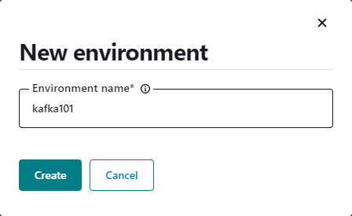
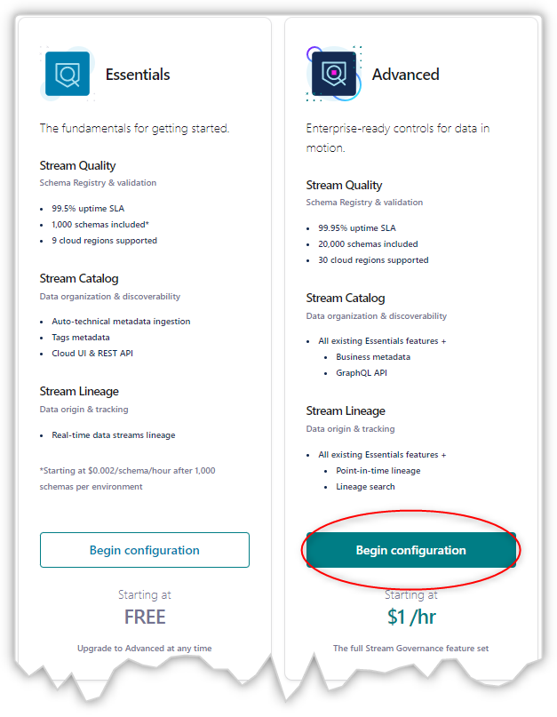
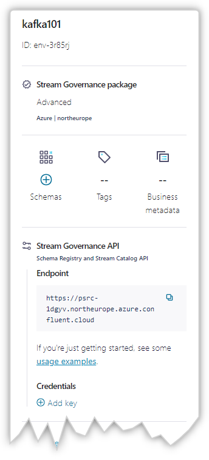
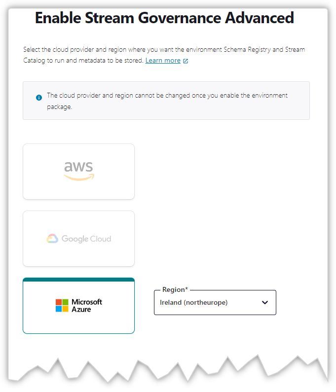
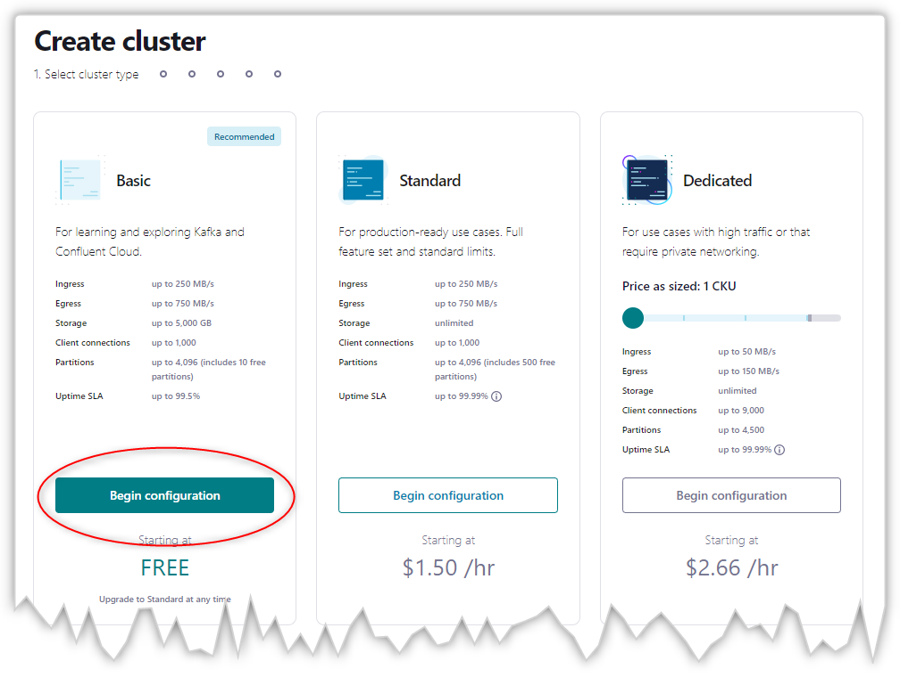
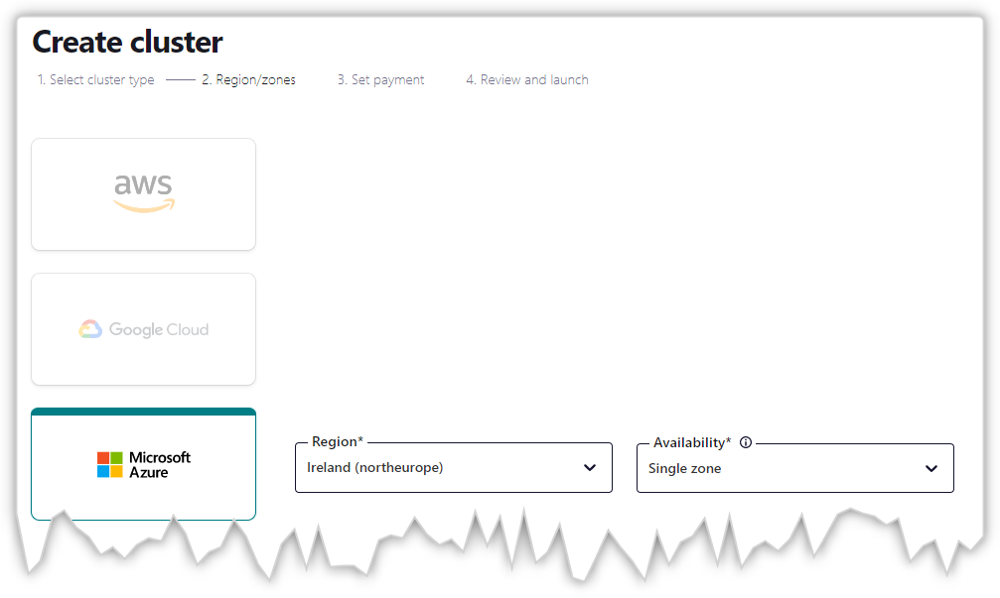
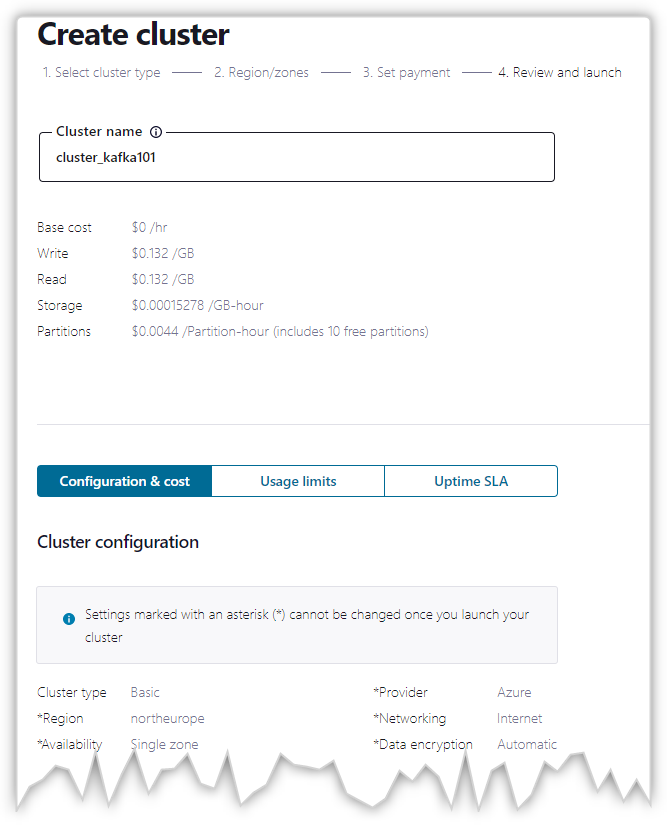

# Kafka Configuration

## Create Kafka Environment

Using [confluent.cloud](https://confluent.cloud/home)

Click **View environments**

Click **+ Add cloud environment**

Give it a name. `kafka101` in this example.

Click on **Begin Configuration** for the tier you need. In this example we're using *Advanced* tier to get all the cloud region options and data lineage.

Review you environment's details:

## Create Kafka Cluster

Choose a cloud provider, a region and click on **Enable**.

Create a Cluster

Choose a region for teh Cluster

Choose **Skip payment**

Give the cluster a name, `cluster_kafka101` in this example, and review the configuration as some options can't be changed once the cluster is launched.

Click **Launch cluster**
